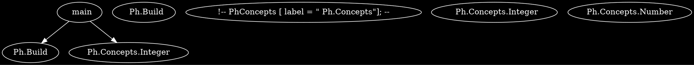
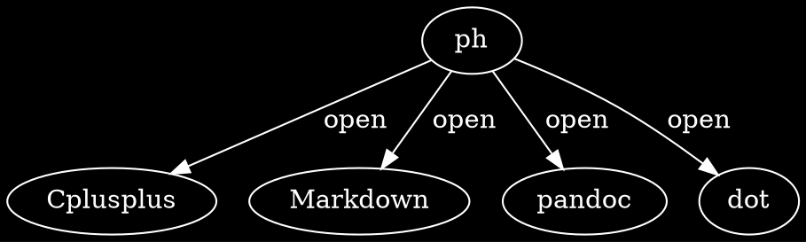
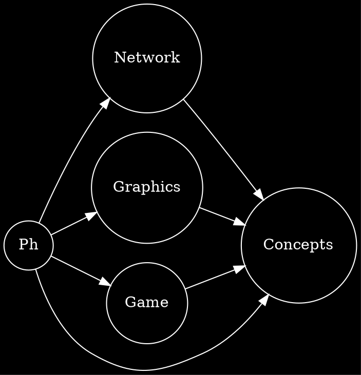
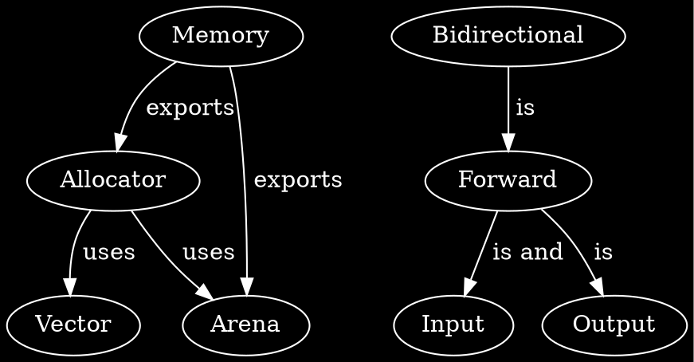
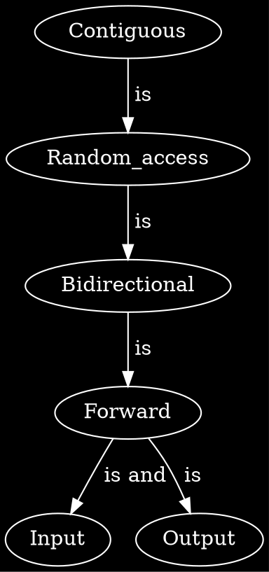
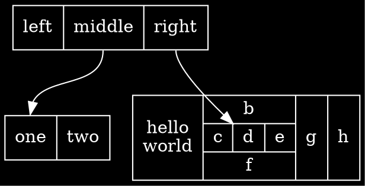

[Ph]: https://github.com/phiwen96/ph


Introduction
===============

<!-- An inline {#id .class width=30 height=20px} -->

[Ph] is a software project that aims to be the facto software for both building and testing the best C++ software.
It aims to cut loose from other languages in the build steps, instead integrating them directly in the source code such as this:


```{#kuk .cpp .numberLines}
import Ph.Build;
import Ph.Concepts.Integer;

auto main (int i, char** s) -> int 
{

	Arguments auto args = parse_args (i, s);

	Error auto err = len (args) > 0 ? true : false; 

	if (err)
	{

	}

	return err;
}
```



"Ph" is a lightning fast C++ library and also a build tool (such as Cmake or Make) for turning C++ source code into something useful.


It introduces c++ concepts and modules, by which the former it is built around, thus, making it lucrative for industrial applications where the need for precision is critical, and where most of the bugs can be catched before the c++ files are even compiled, thus simply just generating syntax errors for developers. 
Introducing this core language feature has huge pros for industrial-strength generic components, AKA good software.
This is what we want! We dont want python's "throw in whatever type u desire", and not java's somewhat pragmatic "please specify the type". 
We want to be able to say "hey, other coders out there using this function im about to type, just throw in a String". 
String is just a concept that we specify. It could be everything from "std::string" to old plain c string "char const *". We say "hey, String can be either a "std::string" or a "char const*". OR it could be anything that we could do the following with:

```{#kuk .cpp .numberLines}
template <typename S>
concept String = requires (S s)
{
	s.size ();
	{s [0]} -> char;
}
```


 Goals with this project
 ===============

- [X] Motivation

- [ ] Just c++, even for building.

	All software are built around a set of programming languages, often one for front-end and one for back-end. The reason for this, unknown. One can only guess.

	I can not stress this enough, but writing software in one language has huge upside effects, and it's much cheaper. Your teams can speek the same language, thus making it much easier for further intrigues.  

- [ ] C++ interpreter
  
	Similar to python interpreter.


Details
===============

file dependency
```graphviz
digraph file_dependencies 
{
	graph [bgcolor=black]
	node [fillcolor=black style=filled color=white fontcolor=white]
	edge [color=white fontcolor=white]

	"main" -> "main.o"

	"main.o" -> "main.cpp"
	"main.o" -> "Ph.pcm"
	
	
	
}


Project dependencies
---------------

The following graph describes that basically "ph" is a set of files which will either be transformed into a documentation file or into the executable software. 

```graphviz
digraph finite_state_machine {
	graph [bgcolor=black]
	node [fillcolor=black style=filled color=white fontcolor=white]
	edge [color=white fontcolor=white]

	"ph" -> "source code" [ label = "  contains"];

	"ph" -> "documentation" [ label = "  and contains"];
	
	"source code" -> "C++" [ label = "  written in"];

	"C++" -> "Software" [ label = "  compiled to"];
	
	"documentation" -> "Markdown" [ label = "  written in"];

	"Markdown" -> "plantuml" [ label = "  mixed with"];

	"plantuml" -> "uml" [ label = "  mixed with"];

	"Markdown" -> "graphviz" [ label = "  mixed with"];
	
	"documentation" -> "dot" [ label = "  and written in"];

	"dot" -> "graphs like this" [ label = "  for generating"];

	"dot" -> "pandoc" [ label = "  built with"];

	"pandoc" -> "pandoc-plot" [ label = "  with the help of"];
}
```

---------------


### Source code written in

[C++]: https://www.cplusplus.com

* [C++]

#### and built with 

[Make]: https://www.gnu.org/software/make/

* [Make]


About
===============


Documentation
===============
The documentation for [Ph] is dependent on the the following languages:

[Markdown]: https://www.markdownguide.org/basic-syntax/
[dot]: https://graphviz.org/doc/info/lang.html
[UML]: https://en.wikipedia.org/wiki/Unified_Modeling_Language
[English]: https://en.wikipedia.org/wiki/English_language

* [Markdown]
* [dot]
* [UML]
* [English]

and built with
---------------
[pandoc]: https://pandoc.org
[pandoc-plot]: https://github.com/LaurentRDC/pandoc-plot

* [pandoc]
* [pandoc-plot]


Contribute
===============
At the moment, the project is very dependent on Make (for compiling C++ files into different things and then finally everything into an executable).

Also pandoc (for documentations). 
	
Reasons for this? 
It's still very young.

Please help me develop this project! At the moment there are just one developer.


Licensing
===============

[MIT](LICENSE) © 2021 Ph

Can be either open or proprietary.



 <!-- proprietary -->




## Concepts architecture



## Iterator-relations



